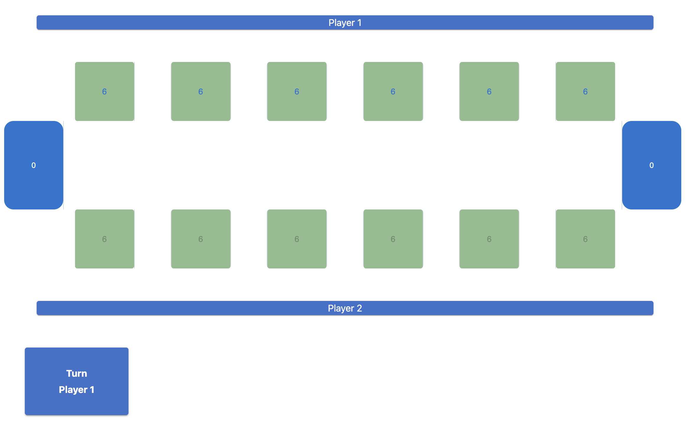
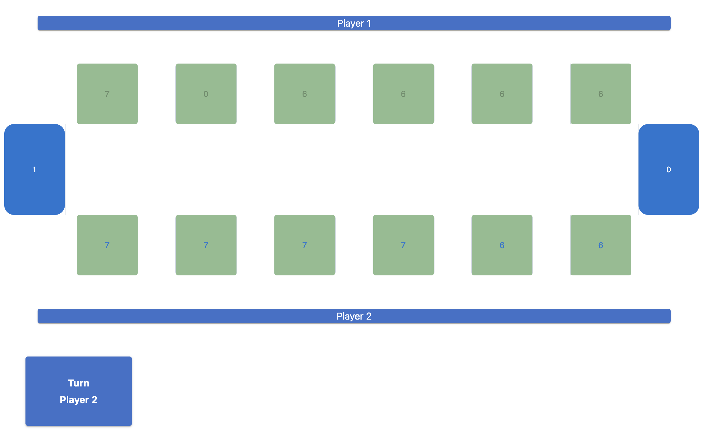
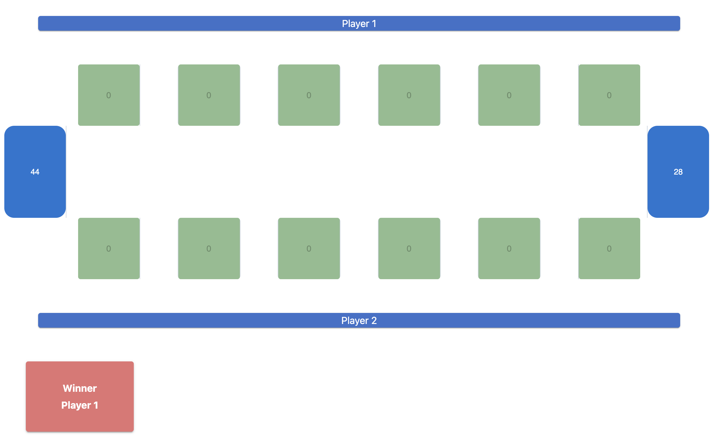

# Kalaha Game Project #

This application implements Kalaha Game. In the game, there are 2 players. Each of the two players has his six pits in front of him. To the right of the six pits,
each player has a big pit. At the start of the game, there are six stones in each of the six little pits and there is no stones in the big pits.

This project has both backend and frontend implementations as a separate projects. The repositories are provided in [backend](https://github.com/yagmurAksan/kalaha-backend) and [frontend](https://github.com/yagmurAksan/kalaha-frontend) repositories.

## Technology Stack ##
- `IntelliJ IDEA` is used as IDE for the implementation.
- For the frontend, I use `React 18.2.0`.
- `Node.js 20.8.0` is used for the server to run the React code.
- `Material UI library` used for the design of the components.

## Project Architecture ##
For the frontend, I separate components as I can. There are 6 components:
+ `BigPit` is for showing big pits of the players with the stone numbers.
+ `Button` is for making the little pits clickable and so sowable.
+ `Game` is a main component of the frontend project.
+ `Information` for showing the turn of the players and the result of the game as a winner player.
+ `LittlePit` is for showing little pits of the players with the stone numbers.
+ `Player` is for showing the side of the players on the board.

I also use some config files:
+ axiosConfig for setting the base url of the server.
+ config for constant values.

## API Design ##

When you first start the application, the default initial values for the game will be set and the page will be seen as below.

Green squares show the little pits and the blue squares show the big pits. 
At the beginning, Turn will belong to the Player 1 and is shown at the bottom. 
So, only the little pits of him are clickable, if they have stones greater than 0. 

When you click one of the little pit of the First Player, the page will be seen as below. 

Sowing is automatically realised and Turn of the Game is changed(If the rule applies).

After some turns of the players, the game is ended as below. 
The winner of the game is shown at the bottom and the little pits are not clickable anymore. 

## How to run ##

In order to run the project, Node.js must be installed on the computer.

In order to start the application, `npm install`(only before the first run) and `npm start` commands must be run on the terminal.

When you start the application, you can access the Game UI at this address: http://localhost:3000/
